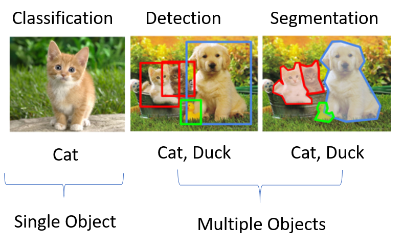
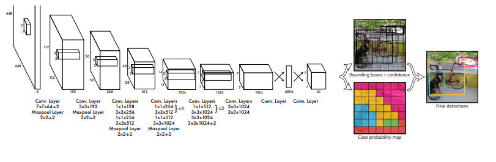
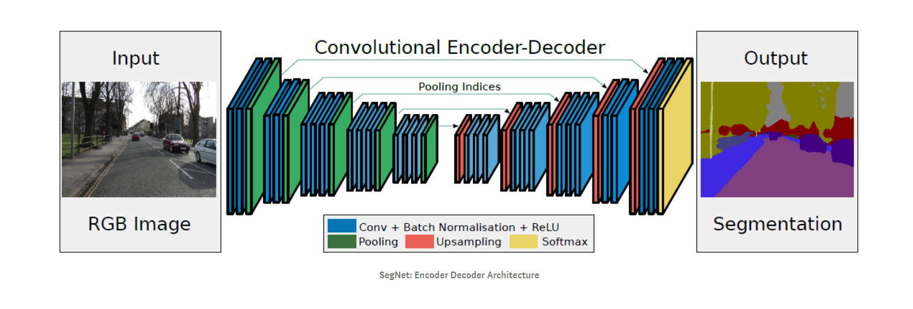
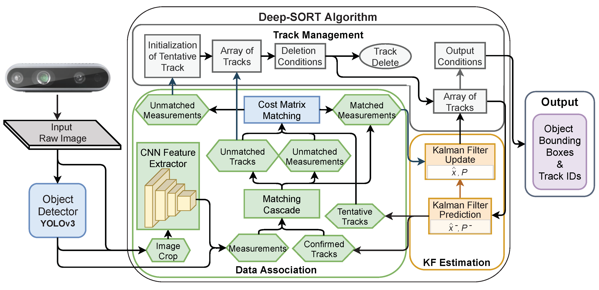

# Deep Learning Architectures

This repo is meant to act as top level reference and not so much a thorough explanation of the many deep learning architectures. Its primary purpose is to lay out the major categories of deep neural networks and some of the most important architectures with a brief explanation on how they work. It is meant for intermediate level learners to help organize their thoughts on when to use what models, understand a visual of the architecture, a brief explanation of the theory, and how they all relate to each other.

# **Index**

**Convolutional Neural Neworks and Computer Vision**
*   Image Classification
*   Object Detection
*   Segmentation
*   Object Tracking

**Generative Models**
*   AutoEncoders
*   Denoising AutoEncoders
*   Variational AutoEncoders (VAE)
*   Autoregressive Models
*   Generative Adversarial Networks (GAN)
*   Diffusion Models

**Recurrent Models**
*  Vanilla
*  LSTM & GRU
*  Bi-Directional

**Transformers**
*  Transformers for NLP
*  Vision Transformers (ViT)

**Deep Reinforcement Learning**
* Model-Free
  * On Policy
  * Off Policy
* Model-Based

* Genetic Algorithms

# **Convolutional Neural Networks and Computer Vision**

---
**Important Papers:** [LeNet](http://yann.lecun.com/exdb/publis/pdf/lecun-01a.pdf) (Groundbreaking CNN by Yann LeCun in 1998), [AlexNet](https://papers.nips.cc/paper/2012/file/c399862d3b9d6b76c8436e924a68c45b-Paper.pdf), [RESNet](https://arxiv.org/pdf/1512.03385.pdf), [VGG Net](https://arxiv.org/abs/1409.1556), [Inception/Xception](https://arxiv.org/pdf/1409.4842.pdf)

**Use Cases:** Object Detection, Image Classification, Semantic Segmentation, Motion Tracking

Why do we use CNNs on images? Because we are able to extract the necessary low level features while using much less memory than a fully connected layer. By utilizing the convolutional and pooling layers, we are concentrating multiple regions of the image into small low-level features. At the end of convolution and pooling we will have a smaller representation of the image distilled down to its most important features.

Convolutional neural networks work best on data with a large number of features and organized in a way where values next to each other often correlate. It is a method of downsampling data but retaining structure and extracting samples of features. They are most often used on images for the reasons above but can also be used on other data types like text and audio.

To refresh your memory; The **convolutional** layer applies multiple **filters** (values to be multiplied by pixel values) across the image. These filters transform the original data to highlight various features such as egdes, curves, shapes, and texture over many subsections of the image. There are usually several iterations of convolving and **pooling**. Pooling is the process of downsampling the image by sliding a pooling **kernel** over the image of a certain **stride** value, similar to the convolution process. **Max Pooling** will slide across the image with a fixed size grid and distill that portion of the image down to the maximum value between all values within the kernel window. After convolving and pooling you will have a smaller representation of the image. The encoded image can either be upsampled back into its original size (segmentation) or fed into a few fully connected layers for classification, depending on your desired output. See CNN architecture below.

A good resource on CNNs: [CNN Explanation Video](https://www.youtube.com/watch?v=JB8T_zN7ZC0&ab_channel=BrandonRohrer)

### **Image Classification**

Image classification is the task of assigning a class value of perdetermined categories to an image. Image classification generally refers to classifying the image as a whole, as opposed to other computer vision tasks which analyze multiple objects at a time (see object detection below).

The structure of an image classification model can be a simple CNN configuration (as explained above and shown below), with the last layer correlating to probabilities of each image class. Of course the models can become much larger and deeper to account for larger image size and complexity. Recently, CNNs have been supplemented by, and replaced by, Vision Transformers for state of the art results (see transformers section below). Vision transformers do not utilize CNNs.

### **Object Detection**

**Important Papers:** [YOLO](https://arxiv.org/abs/1506.02640)

Object detection is the process of finding individual objects and their coordinates within an image. It started with a simple sliding CNN, which was very slow and computationally expensive. It took a bounding box of a certain size and slid it across every piece of the image to determine if the current selection had an object to be classified. Next, slightly faster methods such as R-CNN and its variants focused on classifying specific regions of interest instead of every possible region in a sliding bounding box, imrpoving speed some. Though it still had its downfalls.

The current most popular object detection algorithm would be YOLO (You Only Look Once) (up to v7 now). While previous methods required classification multiple times over multiple bounding box guesses, YOLO is able to predict all objects and bounding boxes in one forward pass of the image. The trick is in setting up the training data in a way where the image is split up into WxH grid cells. Each grid cell has classification and bounding box coordinates for the object that is within it. The CNN is then trained to output a classification and coordinates for each cell, similar to training data, in one single forward pass.

The result is many bounding boxes for the same object, possibly one for each cell that the object is in. To determine the final bounding box, the model utilizes *Intersection over Union*, which basically sates that the area which has the most overlap of all the bounding boxes for the same object will be the final bounding box.

The image below is of YOLO v1. The final output is a matrix of 7x7x30, which corresponds to the 7x7 grid, a depth of 30 features for each grid. The features will include the bounding box coordinates of the object and a one-hot classification.

### **Segmentation**

Semantic segmentation is the process of taking an image and segmenting everything into a specific class at the pixel level (see image below). Instead of downsampling the image to a fully connected layer of classes and/or coordinates, the image is downsampled and then upsampled back again into the original size. The output pixel values are no longer RGB values but instead values that classify each pixel of the image into a pre-defined category.

Because features tend to get lost in very deep networks, features from earlier layers are added together with later layers of the same dimensions in order to retrieve some of the original features. Known as skip connections. This is also used in Image Classification as well (See RESNet paper above).

### **Object Tracking**

**Use Cases:** Keeping track of obstacles in autonomous driving/ mobility, predicting trajectory of objects, individual object counting (in and out of frame), motion tracking for security cameras, object positioning for augmented reality

Object tracking is estimating the state of a target object present in the scene from **previous scene information**. An ID is given to each object of interest at the time of detection and the model tracks the motion of the specified object. As opposed to running object detection on every frame of a video, object tracking will store movement information on individual objects through time. It also helps in overcoming occlusions, rotation, blurring, etc. of the object in question. The results can be tracking movement history or predicting future position of objects.

Many models utilize the **Kalman Filter**, which estimates probability of the state of a dynamic system, by estimating and correcting object positions. Kalman filters can be used to determine **Optical Flow** of the scene, or the pattern of object movement at the pixel level. 

DeepSORT is arguably the most popular object tracking algorithm (shown below). It works well with complex scenarios compared to other algorithms but at the cost of a more complex algorithm, slower inference time and a GPU requirement. It begins by using YOLO object detection on the current frame, associating the detected objects to the objects already being tracked, initializing and removing object IDs as necessary, and updating the Kalman Filter. Output is a list of bounding boxes with object IDs.

Other algorithms which are generally more lightweight but not as accurate include MDNet, GOTURN, and ROLO.

# **Generative Models**

---

**Use Cases:** Denoising or restoring samples (upscale, restoration), generating new samples (text to image, text to speech, segmentation to image), modifying samples (style transfer, image manipulation)

### **AutoEncoder**

**Example Use Case:** *Dimensionality Reduction*

An autoencoder is a fundamental network used for dimensionality reduction and unsupervised feature extraction. The network is trained to take an input and reduce the size in increments, down to a lower dimensional latent space of your choosing. It is able to strip the data down to only it's most essential features while removing unecessary noise. Once it is of a smaller dimension, the network is then expanded again to the original dimensions of the data and compared to the original output. The loss between original and output is used to determine how well the data compression worked. In the end, we really only care about the first half of the model, so that we can obtain a lower dimensional (encoded) data representation, also known as latent space.

### **Denoising AutoEncoder**

**Example Use Case:** *Denoising Audio*

Nearly identical to a standard AutoEncoder, except the input data has noise added to it. Think a pixelated image or audio with background static. The data is once again reduced to a lower dimensional latent space, then expanded out again to the original size. But this time the output is compared to the original data source without the noise. So the network is optimized to take a noisy input, extract the important features, and restore the data to a state with less noise.

### **Variational AutoEncoder (VAE)**

The problem with AutoEncoders, for generation purposes, is that when you encode the data to a latent space, it is not continuous or regularized. There are gaps in the latent space. You want to be able to randomly sample data points from this latent space and decode them in order to generate new features, but it may sample from a gap and not know how to decode properly. Please see external references for this concept, I want to keep these explanations short and I can only explain so much in just a few sentences. Try this: [VAE Resource](https://www.jeremyjordan.me/variational-autoencoders/)

A Variational AutoEncoder ensures that the learned features are distributed properly (continuously and close together) over a mean and variance value instead of a single point, similar to a normal distribution.

Remember that the latent space is the mapping of certain features of the data, encoded to a smaller dimensionality. If we are talking about images, a cluster of the latent space can be dedicated to a smile, to hair color, to whether a person is wearing glasses or not. So a variational autoencoder can take input of an image, encode to the latent space, modify features based on the latent space coordinates, and decode to the same image but with new features.

### **Autoregressive Models**

**Important Papers:** [PixelCNN](https://arxiv.org/abs/1606.05328) (Image), [WaveNET](https://arxiv.org/abs/1609.03499) (Audio)

Autoregressive models are **generative models** for **sequential data** without being recurrent (outputs do not loop back into input in next step). The training can be run in parallel (quicker training) and has a more stable convergence than GANs (below) because it is supervised. One downfall is that inference is computationally expensive.

With Recurrent Neural Networks (below, not yet covered), the output from the network is fed back into the input in order to model sequences, preventing parallelization of training. Autoregressive models feed the *actual* value of the previous step back into model, which is not dependent on model output, which allows for parallelization. During inference the model output will be fed back in as input though.

The image below is a popular representation of the autogregressive model WaveNet by Deepmind, for generating audio. It utilizes a fully connected **causal and dilated** one dimensional temporal convolutional neural network, in order to deal with sequential data. A causal CNN means that the CNN only uses present and past input values to determine present output, excluding future values. Dilated means that its receptive field grows exponentially with depth (blue arrows) to cover thousands of timesteps in the past. The blue dots at the bottom are input values, and the orange is output value, which progress through time because audio is a sequential data type.

### **Generative Adversarial Network (GAN)**

**Important Papers:** [Original](https://arxiv.org/abs/1406.2661) (Ian Goodfellow, 2014) , [CycleGAN](https://arxiv.org/abs/1703.10593), [StyleGAN](https://arxiv.org/abs/1812.04948)

The big breakthrough for generative models in 2014. A GAN trains two models at the same time, which work as an *adversarial* pair. In layman's terms, one network tries to generate convincing data (an image for example) and feeds it into the second network in order to fool it into thinking it is a real image. The second network's job is to look at the generated output and determine if it is real data or generated. The generator is penalized for not being able to generate a sample that can fool the discriminator and the discrimitator is penalized for incorrectly classifying output from generator as real or fake. Through this process we force the two netwroks to train one another, in a way, to allow for optimal output from the generator. Side note: GANs are notoriously difficult to train.

The generator is, intuitively, the model which generates output data. A random sample of gaussian noise is fed into the generator and it is upsampled to a higher dimensionality through several hidden layers to the appropriate output size. As it passes through the network the random input is transformed into something that closer resembles a real sample. It will be nonsense at the start of training, then become better as it begins to fool the discriminator.

The discriminator is a classifier which classifies output from the generator as real or fake. The error of its guess is determined and updates the discrimator through standard backprop, increasing its ability to classify. As it trains it will become better at classifying, which will in turn produce better outputs from the generator.

### **Diffusion Models**

**Important Papers:** [Sohl-DickStein et al.](Sohl-Dickstein) (2015), [Nichol et al.](https://arxiv.org/pdf/2102.09672.pdf) (2021), [Dall-e 2](https://cdn.openai.com/papers/dall-e-2.pdf) (2022)

An increasingly popular generative model (image generation especially) with SOTA results and more stable to train than GANs. Diffusion models successively add Gaussian noise to training samples, and then learn to recover the data by reversing this noising process. At inference, we can input random noise and the model will return structured data.

The neural network is actually learning the noise of the previous step so that it can be removed and become one step closer to a 'noiseless' image. The network is modeled as a markov process, which means the result is only dependent on the current step without regard to data from previous steps. The only requirement for the model is that its input and output dimensionality are identical. A U-Net architecture is the popular choice for determining the noise posterior. The actual architecture of the network is flexible.

During training, the model learns the noise distribution that was added in the previous step. During inference, the model is fed a noisy image and predicts the noise distributuion to be removed. The image is passed through the model thousands of times, on each pass removing a small amount of noise, until the image is clear of any noise.

# **Recurrent Neural Networks**

---

**Use Cases:** Natural Language Processing, Machine Translation, Sentiment Classification, Speech Recognition, Temporal Analysis and Generation, Time Series Prediction

RNNs analyze sequences. They have been used heavily for NLP (Natural language processing) in order to capture meaning through the order of words in a text. Audio is also highly dependent on sequences over time, and many video generation/ analysis techniques will require information about multiple previous frames to make a prediction. Datasets that rely heavily on change over time will benefit from recurrent neural networks.

The fundamental concept of RNNs is that they take in a standard input, produce an output, and feed the output back into the model along with the next input in the sequence. So at step two of the sequence, the model accepts the second input plus information about the first step. At step three the model accepts the third input plus the previous output, which has information about step one and step two embedded in. And so on.

The fundamental problem with this vanilla case of RNN is that the memory begins to fade over time. By the twentieth iteration of the run, information of the first and second iteration starts to get lost in the output data and overshadowed by information about the more recent iterations. In general, RNNs have issues with backpropagation through time, getting stuck in local minima, and vanishing gradient.

Three types of RNNs:
1.   **One - Many** One input vector, model output recursively fed back into model for multiple output values. (Image to text captioning)
2.   **Many - One** Multiple input vectors fed into network, one at a time, with previous model output fed in at the same time. One output. (Text classification)
3.   **Many - Many** Multiple vectors fed into model, one at a time, along with model output, with multiple output vectors. (Language translation)

### **Long Short Term Memory (LSTM) / Gated Recurrent Units (GRU)**

As mentioned above, vanilla RNNs suffer from poor long term memory. LSTMs and GRUs were created to allow more information from earlier in the sequence to be remembered. It achieves this by 'forgetting' non-relevant pieces of information and passing through only the most important data to the next pass. In this way the model is able to retain much more information from past values in the sequence with the same amount of memory and without becomming overloaded with irrelevant information. The network determines which data is relevant through training, by passing it through a series of sigmoid functions (output between 0 and 1) and removing it or adding it to the **cell state** (memory) on each pass.

LSTMs and GRUs have similar goals and methods to achieve them. GRUs are able to save on some memory, making them slightly faster to train. LSTMs are said to work better for NLP in general. It may be a good idea to train each and see which performs better for your specific application.

A good resource: [LSTMs & GRUs](https://towardsdatascience.com/illustrated-guide-to-lstms-and-gru-s-a-step-by-step-explanation-44e9eb85bf21)

### **Bi-Driectional RNNs**

All of the methods above traditionally run through the sequential data in order from beginning to end, so outputs can only be dependent on past and present data. But there are many sentences where important information is held in the second half of the sentence which gives context to the first half of the sentence. So if we are feeding the sentence into our network, word by word, the output values of the first half may not be completely accurate because it doesn't yet have the context of the second half of the sentence. (e.g. Today is my dad's birthday, *if he were still alive*.)

BRNNs are fairly simple to understand and implement, you really just need to add a new layer to the network which begins taking input from the end of the data and works its way backwards to the beginning. This way the combined output values have context from the beginning and end of the sentence as it feeds the data through. 

# **Transformer Networks**

---
**Use Cases:** Advanced Natural Langauge Processing, Text Generation, Language Translation, Text Summarization, Image Classification

Proposed in 2017, works with sequential data but neither convolutional nor recurrent, which helps reduce memory fading over time. And now you can parallelize traing to make it much more efficient. Very popular in SOTA NLP models such as GPT and BERT - with the highest ranking models usually trained on the largest parameter size with the most amount of training data. It is responsible for many SOTA NLP and CV models and one of the biggest DL advancements in recent history. Transformers require a very large amount of data to train well so that is probably the major downfall of the model.

### **Standard model used in NLP**

**Important Papers:** [Attention is all you Need](https://arxiv.org/abs/1706.03762)

The two primary concepts that you need to know for transformers are **positional encodings** and **self-attention**.

Other models that process sequential data (RNNs, Autoregressive) require the data to be fed in sequential order to understand relationships between words. **Positional encodings** allow the model to encode the position of each word along with the text encoding. This allows the model to understand past, present, and future relations between words all at once. It also means that the model can be parallelized during training.

**Self attention** helps map relationships between words. It is really just a vector of weights learned through training on very large text datasets which provides information on how much individual words relate to other words in the sentence. It allows the model understand the sentence structure better through context of other words and focus on the most important aspects of the sequence.

### **Vision Transformers**

**Important Papers:** [ViT](https://arxiv.org/abs/2010.11929)

Just entering the scene a few years ago, vision transformers (ViT) utilize the same positional encoding and attention mechanism from transformers for computer vision applications. ViTs have quickly become SOTA for image classification and other computer vision applications. They are able to outperform convolutional neural networks for tasks like image classification if the training dataset is very large.

An image is first separated out in a series of patches (16x16 in original paper). Each patch is given a positional encoding to retain it's original structure, and fed into a transformer encoder that is very similar to the original NLP transformer model. Attention is used again to determine how regions of the image correlate to one another (instead of correlation of words). The output is then fed into a fully connected layer for classification.

# **Deep Reinforcement Learning**

---
**Use Cases:** Maneuvering Robotics, Playing Games, Trading Stocks, Any exhaustive search of many possible outcomes

How is RL different than anything we've seen? RL is neither **supervised** (input data is labeled, and labels are compared to model output to determine error), or **unsupervised** (model is tasked with finding natural patterns and associations in the data, such as Attention or GANs). With RL there is not a premade dataset to train on such as supervised and unsupervised models - the data is being created continuously through simulation or real-world actions.

RL consists of setting up an enviornment and allowing the model to determine optimized long-term actions through *trial and error*. A series of steps are conducted sequentially and certain steps are 'rewarded' if the outcome is favorable, and 'punished' if the outcome is not favorable. It is up to the creator of the model to determine all of these parameters. 

Deep RL is often categorized into two main categories:
1.  **Model Based:** Used when we have a complete understanding of a fixed environment and can model future states accurately. The agent is able to plan ahead due to guaranteed response information for future moves and has much higher sample efficiency. (Games)
2.  **Model Free:** When he have incomplete information about the environment. Information about the enviornment is learned through experience. Since most environments can not be modeled perfectly in the real world, model free RL is a more common approach. (Real-world scenarios)

The **policy** is the overarching strategy used to determine which action should be performed next, given the current state. Within **Model Free** type algorithms there are two major types:
  
1.  **On-Policy**: On-Policy methods strictly try to improve the policy that is being used to determine the best actions for the agent. The same policy that is being used to decide actions is being updated.

2.  **Off-Policy** (Q-Learning): Off policy methods do not necessarily evaluate the same policy used to generate actions. It figures out the optimal policy regardless of the agent's motivation.

There is A LOT to understand about reinforcement learning and it is not my strong suit so I will leave this section brief.

[A good top level resource](https://spinningup.openai.com/en/latest/spinningup/rl_intro2.html)

### **Genetic Algorithms**

**Use Cases:** Model Optimization

Though genertic algorithms are not directly related to RL, they are similar enough for me to just tack it onto this section instead of creating a new section for it. You can find plenty of videos online of AI "evolving" to learn to walk, perform an activity, or play a game via genetic algorithms. But you can also use genetic algorithms on any NN type in order to optimize hyperparameters or weights.

The basic idea is to iteratively initialize a set of neural networks, evaluate and find the top performers, generate a new set of NNs with the same parameters/ hyperparameters as the top performers with some "mutations" (changes in parameters). Evaluate this new set, determine top performers, add mutations, rinse and repeat until you have an optimal solution.
